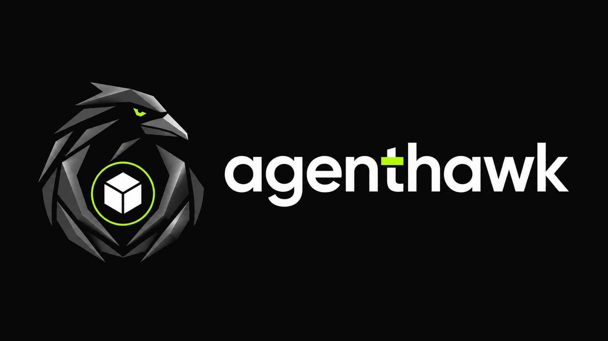

<p align="center">
  
</p>

<h1 align="center">AgentHawk</h1>

<p align="center"><strong>The security layer between AI coding agents and your codebase.</strong></p>

<p align="center">
  <a href="https://github.com/nafiyad/AgentHawk/actions/workflows/quality.yml"></a>
  <a href="LICENSE"></a>
  
  
</p>

AgentHawk is a local-first, deterministic security gate that checks dependencies proposed by AI coding agents before they enter a repository.

> **Project status:** `@agenthawk/core@0.1.0-alpha.1` and `@agenthawk/cli@0.1.0-alpha.1` are public npm alpha packages. The admission-control scope is implemented, but the alpha is not a complete security control and an `ALLOW` verdict is not proof that a dependency is benign.

[Why AgentHawk](#why-agenthawk) · [Current capabilities](#current-capabilities) · [Install](#install-the-public-alpha) · [Roadmap](#product-roadmap) · [Development](#development) · [Security](#security-and-privacy-posture) · [Contributing](#contributing)

## Why AgentHawk

Coding agents can propose or install plausible-looking dependencies without the context a maintainer would normally gather. AgentHawk is being designed to resolve the exact request, collect bounded evidence, apply explicit repository policy, and return an explainable `ALLOW`, `WARN`, `REVIEW`, `BLOCK`, or `ERROR` result before installation.

AgentHawk will not use an LLM as the authority for security decisions, execute package code during evaluation, require an AgentHawk account, or claim that a package is universally safe.

## Current capabilities

- Conservative parsing and classification of npm dependency requests
- Bounded, redirect-aware npm registry metadata retrieval
- Normalized package/version, registry-provided distribution integrity, repository, deprecation, and lifecycle-script metadata
- Strict deterministic PG001–PG007, PG010, PG011, PG013, and PG015 policy findings with stable verdict precedence (PG005 name-similarity runs during `scan` against the manifest's other direct dependencies)
- `agenthawk check npm <package-spec>` with terminal/JSON output, strict mode, policy and approval files, bounded caching/offline operation, and stable exit codes
- `agenthawk policy validate --file <path>` with the production strict YAML boundary, normalized policy digest, and no provider access
- `agenthawk approvals verify --file <path>` with exact-coordinate validation, aggregate approval-time state, a semantic digest, and no approval application
- `agenthawk doctor` with bounded offline runtime, package-alignment, cache, Git, configuration-file, and advisory-integration diagnostics
- `agenthawk scan` for aggregate policy evaluation of every bounded root-manifest direct dependency without executing repository code
- `agenthawk diff --base <git-ref>` for direct dependency additions/version changes and PG014 lockfile correlation
- Bounded OSV query, pagination, and batch-match hydration without executing package code
- Stable redacted provider errors without package installation or execution
- Read-only GitHub pull-request evaluation with an isolated opt-in write commenter
- Fail-closed advisory templates for Codex, Claude Code, Cursor, and generic agents
- A packaged, release-pinned Codex `PreToolUse` compatibility candidate with exact local Windows CLI and app-server host evidence, root-bound hook/receipt lifecycle commands, and invocation-time pair verification; activation and support remain gated
- A packaged, release-pinned Claude Code `PreToolUse` fixture edge plus read-only project-settings collision preflight; configuration mutation and native support remain gated
- Exact release-package manifests, dual-use disclosure, checksummed CI artifacts, and protected stage-only trusted publishing for future versions
- Offline fixtures and security regression tests

See [approvals](docs/approvals.md) for the exact exception model.
See [GitHub Actions integration](docs/github-action.md) for the read-only pull-request workflow and opt-in idempotent comments.
See [AI agent integrations](docs/agent-integrations.md) for copyable Codex, Claude Code, Cursor, and generic fail-closed instruction templates.
See the [CLI JSON contract](docs/json-contract.md) for versioning, report families, failure envelopes, and stable exit codes.
See [release operations](docs/releasing.md) for the verified bootstrap record, package gate, protected OIDC staging, and publication boundaries.
See [alpha acceptance status](docs/alpha-acceptance.md) for the implemented-scope matrix, release status, and explicitly deferred platform work.
See [the age-threshold decision](docs/adr/0007-policy-age-thresholds.md) for the evidence, real-project calibration, and limitations behind the default review windows.

## Install the public alpha

```bash
npm install --global @agenthawk/cli@alpha
agenthawk --version
```

Use `@alpha` or the exact `0.1.0-alpha.1` version in automation. npm requires every package to have a `latest` tag, so the first public alpha is also the current default install even though it remains prerelease software.

The currently published `0.1.0-alpha.1` package does not include `agenthawk init`. Initialization is implemented in this source revision and will be available only in a package version released from it; use `agenthawk --help` to verify the commands present in an installed version.

## Check a proposed dependency

AgentHawk evaluates metadata only; it does not install the package.

```bash
pnpm agenthawk check npm example-package@1.0.0
pnpm agenthawk check npm example-package@1.0.0 --strict --format json
pnpm agenthawk check npm example-package@1.0.0 --policy .agenthawk.yml
pnpm agenthawk check npm example-package@1.0.0 --offline
pnpm agenthawk check npm example-package@1.0.0 --no-cache
pnpm agenthawk policy validate --file .agenthawk.yml --format json
pnpm agenthawk approvals verify --file .agenthawk/approvals.yml --format json
pnpm agenthawk doctor --format json
# Available from this source revision; not in the published 0.1.0-alpha.1 package.
pnpm agenthawk init --integration none --format json
pnpm agenthawk integrations codex status --format json
pnpm agenthawk integrations codex install --format json
pnpm agenthawk integrations codex remove --format json
pnpm agenthawk integrations claude status --format json
pnpm agenthawk scan --format json
pnpm agenthawk diff --base origin/main --strict --format json
```

`init` creates a deterministic root `.agenthawk.yml` and at most one selected advisory template without overwriting different content. Existing instruction files must be merged manually. See [initialization and recovery](docs/initialization.md).

`integrations codex install` exclusively publishes one root-bound receipt and hook without replacing existing configuration; `remove` deletes only an exact or inactive owned pair. Invocation re-verifies the pair before declaring project deployment trust. These commands do not trust or enable the hook, and successful publication does not prove that Codex loaded or executed it. A foreign or abandoned lock and every unprovable crash state fail closed for operator review; no PID, age, locality, hostile-filesystem, or power-loss-durability claim is made.

`integrations claude status` is read-only. It observes the fixed project shared/local settings, root-bound receipt, operation lock, and lock-derived staging target through matching bounded snapshots. It separately reports ownership (`absent`, exact, inactive, modified, unowned, collision, or unsafe), current packaged-artifact readiness, shared `PreToolUse`/`disableAllHooks` blockers, and quiet ignored/untracked results without returning settings, paths, identifiers, digests, ignore patterns, or parser diagnostics. Exit `0` means either that future installation preconditions hold or that an exact owned pair matches the current artifacts; activation remains `unproven`, and no Claude install/remove command exists.

Native enforcement remains unsupported. The exact Codex CLI `0.149.0` Windows
x64 project-hook row has strong local compatibility evidence, but the pinned
GitHub-hosted Windows environment rejects the exact restricted-token filesystem
projection before the complete matrix can run. See the [support
matrix](docs/support-matrix.md). Claude Code `2.1.241` has a packaged, closed
fixture adapter, root-bound invocation verification, and receipt-aware read-only status but no settings mutation lifecycle,
exact-host compatibility evidence, or supported native row. See [ADR 0015](docs/adr/0015-claude-code-hook-edge.md), [ADR 0016](docs/adr/0016-claude-project-hook-ownership.md), and [ADR 0017](docs/adr/0017-claude-project-hook-transaction.md). The published `0.1.0-alpha.1` package also
predates these source-revision commands; protected `scan`/`diff` CI remains the final
repository gate.

Exit codes are `0` for allowed/non-strict or ready diagnostic results, `1` for strict review/block findings or diagnostic attention, `2` for invalid input or policy, `3` for required provider/evaluation failure, and `4` for unexpected internal failure.

## Development

```bash
pnpm install
pnpm lint
pnpm typecheck
pnpm test
pnpm test:coverage
pnpm build
pnpm agenthawk --help
```

Node.js 22 or 24 LTS and pnpm 10 are required. See the [support matrix](docs/support-matrix.md) for the distinction between declared compatibility, CI evidence, and deferred platforms.

## Product roadmap

The first alpha completed its deliberately narrow npm dependency-admission scope. The next release train adds operator tooling, native pre-action agent hooks, workspace-aware admission, interoperable reporting and local receipts, then carefully bounded provenance and ecosystem expansion.

See the evidence-backed [product roadmap](docs/roadmap.md) for priorities, milestone dependencies, security gates, and measurable exit criteria. The [architecture](docs/architecture.md), [threat model](docs/threat-model.md), and [completed alpha implementation plan](docs/implementation-plan.md) remain the source of truth for current behavior.

## Security and privacy posture

AgentHawk is local-first and will not include telemetry. Repository source code and credentials must never be sent to evidence providers. Provider failure will never silently become an allow decision.

Report suspected vulnerabilities privately using the process in [SECURITY.md](SECURITY.md).

## Contributing

AgentHawk is in active foundation work. Please read [CONTRIBUTING.md](CONTRIBUTING.md) and the [Code of Conduct](CODE_OF_CONDUCT.md) before opening a contribution.

## License

Licensed under the [Apache License 2.0](LICENSE).
